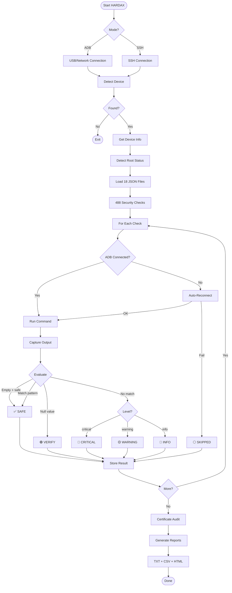

# HARDAX v2.0

<p align="center">
  
  
  
  
  
</p>

<p align="center">
  <b>Hardening Audit eXaminer for Android OS based Connected Devices</b><br>
</p>

```
    ┏━━━━━━━━━━━━━━━━━━━━━━━━━━━━━━━━━━━━━━━━━━━━━━━━━━━━┓
    ┃  ██╗  ██╗ █████╗ ██████╗ ██████╗  █████╗ ██╗  ██╗  ┃
    ┃  ██║  ██║██╔══██╗██╔══██╗██╔══██╗██╔══██╗╚██╗██╔╝  ┃
    ┃  ███████║███████║██████╔╝██║  ██║███████║ ╚███╔╝   ┃
    ┃  ██╔══██║██╔══██║██╔══██╗██║  ██║██╔══██║ ██╔██    ┃
    ┃  ██║  ██║██║  ██║██║  ██║██████╔╝██║  ██║██╔╝ ██╗  ┃
    ┃  ╚═╝  ╚═╝╚═╝  ╚═╝╚═╝  ╚═╝╚═════╝ ╚═╝  ╚═╝╚═╝  ╚═╝  ┃
    ┃  [488 Checks] [18 Categories] [3 Report Formats]   ┃
    ┗━━━━━━━━━━━━━━━━━━━━━━━━━━━━━━━━━━━━━━━━━━━━━━━━━━━━┛
```

---

## Table of Contents

- [Overview](#-overview)
- [Features](#-features)
- [Supported Devices](#-supported-devices)
- [Installation](#-installation)
- [Usage](#-usage)
- [Security Categories](#-security-categories)
- [Status Levels](#-status-levels)
- [Tool Flow](#-tool-flow)
- [Extending HARDAX](#-extending-hardax)
- [Future Roadmap](#-future-roadmap)

---

## Overview

**HARDAX** (Hardening Audit eXaminer) is a comprehensive security configuration auditor for Android-based devices. It performs **488 security checks** across **18 categories** to identify misconfigurations, vulnerabilities, and security weaknesses.

HARDAX is designed for:
- **Security Researchers** - Penetration testing and vulnerability assessment
- **IoT Security Teams** - Auditing Android-based IoT devices
- **POS Security Auditors** - PCI-DSS compliance verification for payment terminals
- **Enterprise Security** - MDM compliance verification
- **Developers** - Pre-release security validation

---

## Features

| Feature | Description |
|---------|-------------|
| **488 Security Checks** | Comprehensive coverage across 18 security categories |
| **POS/Payment Terminal Support** | 24 PCI-DSS focused checks for payment devices |
| **Malware & Hooking Detection** | 16 checks for rootkits, RATs, Frida, Xposed, keyloggers, memory scrapers |
| **Certificate Audit** | CA certificate analysis with expiry/age calculation |
| **No Root Required** | Runs entirely via ADB shell commands |
| **Root Auto-Detection** | Detects root (Magisk/SuperSU/su) and uses `su -c` for privileged commands |
| **ADB Resilience** | 5-layer protection: connection check, auto-reconnect, timeout, SKIPPED status |
| **Dual Connection Modes** | ADB (USB/Network) and SSH support |
| **5 Status Levels** | SAFE, WARNING, CRITICAL, VERIFY, INFO, SKIPPED |
| **3 Report Formats** | TXT, CSV, HTML with interactive dashboard |
| **False Positive Prevention** | Smart null/empty handling with VERIFY status |
| **Extensible JSON Checks** | Easy to add custom security checks — drop JSON, run |
| **Beautiful CLI Output** | Color-coded real-time progress display |
| **Device Info Collection** | Automatic device fingerprinting |

---

## Supported Devices

HARDAX works with any Android-based device accessible via ADB or SSH:

| Device Type | Examples |
|-------------|----------|
| **POS Terminals** | PAX, Verifone, Ingenico, Sunmi, Newland, Clover, Square |
| **Smartphones & Tablets** | Samsung, Pixel, OnePlus, Xiaomi, etc. |
| **IoT Devices** | Android Things, AOSP-based smart devices |
| **Collaboration Panels** | Poly, Neat, Webex Board |
| **Android Automotive** | Infotainment systems, head units |
| **Medical Devices** | Android-based clinical devices |
| **Industrial Android** | Rugged tablets, handheld scanners |
| **Android TV** | Smart TVs, set-top boxes |
| **Wearables** | Wear OS devices |

---

## Installation

### Prerequisites

- Python 3.6 or higher
- ADB (Android Debug Bridge) installed and in PATH
- USB Debugging enabled on target device

### Quick Start

```bash
# Clone the repository
git clone https://github.com/iotsrg/hardax.git
cd hardax

# Connect your device via USB
adb devices

# Run HARDAX
python3 hardax.py
```

### Optional Dependencies

```bash
# For Linux
pip install paramiko cryptography

# For Windows
py -m pip install -r requirements.txt
```

---

## Usage

### Basic Usage (ADB)

```bash
# Auto-detect connected device
python3 hardax.py

# Show commands being executed
python3 hardax.py --show-commands

# Load all check files from commands/ directory
python3 hardax.py --json-dir commands

# Specify device by serial
python3 hardax.py --serial DEVICE_SERIAL

# Custom output directory
python3 hardax.py --out ./my_reports

# Skip certificate audit
python3 hardax.py --skip-certs
```

### SSH Mode (Network)

```bash
python3 hardax.py --mode ssh --host 192.168.1.100 --ssh-user root --ssh-pass password
```

### Network ADB

```bash
adb connect 192.168.1.100:5555
python3 hardax.py --serial 192.168.1.100:5555
```

### All Options

```
usage: hardax.py [OPTIONS]

Options:
  --version             Show version
  --mode {adb,ssh}      Connection mode (default: adb)
  --serial SERIAL       ADB device serial number
  --host HOST           SSH hostname/IP
  --port PORT           SSH port (default: 22)
  --ssh-user USER       SSH username
  --ssh-pass PASS       SSH password
  --json FILE           Path to single JSON checks file
  --json-dir DIR        Directory with JSON check files
  --out DIR             Output directory (default: hardax_output)
  --progress-numbers    Show numeric progress counter
  --show-commands       Display each command being executed
  --skip-certs          Skip certificate audit
```

---

## Security Categories

HARDAX organizes **488 checks** into **18 security categories**:

| Category | Checks | Description |
|----------|--------|-------------|
| **SYSTEM** | 89 | Kernel, memory, TEE, time, power, build properties, emulator detection, SIM status |
| **NETWORK** | 74 | Ports, WiFi, cellular, VPN, MQTT, CoAP, CAN bus, HL7, DICOM, active connections |
| **PRIVACY** | 51 | Biometrics, screen lock, location, sensors, clipboard, audio |
| **APPS** | 50 | Permissions, overlay attacks, installation sources, backup audit, dangerous perms |
| **BLUETOOTH** | 29 | BLE/Classic security, pairing modes, profiles, MAC randomization |
| **SELINUX** | 25 | SELinux enforcement, policy, audit, context, boot flags |
| **POS_SECURITY** | 24 | PCI-DSS compliance, payment apps, kiosk mode, RAM scraper, NFC relay, PAX CVE |
| **STORAGE** | 21 | Filesystem, backup, encryption, partitions |
| **CIS_BENCHMARK** | 20 | CIS Android Benchmark v1.6.0 controls (89% coverage) |
| **BOOT_SECURITY** | 19 | Verified boot, AVB, dm-verity, bootloader, integrity |
| **MALWARE** | 16 | Root/Magisk/SuperSU, Frida, Xposed/LSPosed, RATs, keyloggers, memory scrapers, root cloaking |
| **USB_SECURITY** | 14 | USB debugging, interfaces, serial ports, gadget mode |
| **DEVICE_MANAGEMENT** | 13 | MDM, accounts, developer options |
| **CRYPTOGRAPHY** | 12 | Encryption, keys, credentials, API keys, certificates |
| **CERTIFICATE_AUDIT** | 11 | CA certificates, user certs, pinning bypass, keystore, expiry analysis |
| **INPUT** | 9 | Keyboards, accessibility, input methods |
| **NFC_SECURITY** | 7 | NFC state, Android Beam, tap-to-pay, reader mode, secure element (eSE/UICC) |
| **ADB_SECURITY** | 4 | ADB keys, network ADB, debugging |

---

## Status Levels

HARDAX classifies findings into 6 status levels:

| Status | Color | Symbol | Description |
|--------|-------|--------|-------------|
| **SAFE** | 🟢 Green | ✓ | Secure configuration detected |
| **WARNING** | 🟡 Yellow | ⚠ | Potential risk — review recommended |
| **CRITICAL** | 🔴 Red | ✗ | Security issue — immediate action required |
| **VERIFY** | 🟣 Purple | ? | Manual verification required (null/empty output) |
| **INFO** | 🔵 Blue | ℹ | Informational — no action needed |
| **SKIPPED** | ⚪ Gray | ○ | ADB connection lost — check could not execute |

---

## Tool Flow



---

## HTML Report Features

The interactive HTML report includes:

- **Summary Dashboard** — Total checks, pass/fail counts, doughnut chart
- **Device Information** — Model, Android version, build, serial, security patch level
- **Collapsible Categories** — Click to expand/collapse each security area
- **Color-Coded Results** — Green=SAFE, Yellow=WARNING, Red=CRITICAL
- **Certificate Audit Table** — CA certificates with expiry dates and risk status
- **Search & Filter** — Find specific checks by keyword
- **Category Statistics** — Per-category breakdown of findings

---

## Extending HARDAX

### Adding Custom Checks

Create or modify JSON files in the `commands/` directory:

```json
{
  "checks": [
    {
      "category": "CUSTOM",
      "label": "My Custom Port Check",
      "command": "netstat -tlnp 2>/dev/null | grep ':8080'",
      "safe_pattern": "^$",
      "level": "warning",
      "description": "Check if port 8080 is open",
      "empty_is_safe": true
    }
  ]
}
```

### Check Fields

| Field | Required | Description |
|-------|----------|-------------|
| `category` | ✅ | Category name (appears in report grouping) |
| `label` | ✅ | Display name for the check |
| `command` | ✅ | ADB shell command to execute |
| `safe_pattern` | ✅ | Regex pattern — if output matches, result is SAFE |
| `level` | ✅ | Severity if NOT safe: `critical`, `warning`, `info` |
| `description` | ✅ | Explanation of what the check does and why it matters |
| `empty_is_safe` | ❌ | If `true`, empty output = SAFE (default: `false`) |

### Adding Checks — 3 Steps

```bash
# 1. Create your JSON file
echo '{"checks":[...]}' > commands/my_checks.json

# 2. Run with custom directory
python3 hardax.py --json-dir commands/

# That's it — new checks appear in reports automatically!
```

---

## Project Structure

```
HARDAX/
├── hardax.py              # Main engine (2200+ lines)
├── requirements.txt       # Python dependencies
├── README.md              # This file
└── commands/              # Security check definitions
    ├── system.json        #  87 checks — Kernel, TEE, build, emulator, memory
    ├── network.json       #  74 checks — Ports, WiFi, VPN, IoT protocols
    ├── privacy.json       #  51 checks — Biometrics, location, sensors
    ├── apps.json          #  50 checks — Permissions, overlay, backup, install
    ├── bluetooth.json     #  29 checks — BLE/Classic, pairing, profiles
    ├── selinux.json       #  25 checks — Enforcement, policy, audit
    ├── pos_security.json  #  24 checks — PCI-DSS, kiosk, NFC relay, PAX CVE
    ├── storage.json       #  21 checks — Encryption, partitions, backup
    ├── cis_benchmark.json #  20 checks — CIS Android Benchmark v1.6.0
    ├── boot_security.json #  21 checks — Verified boot, AVB, dm-verity
    ├── malware.json       #  16 checks — Root, Frida, Xposed, RATs, scrapers
    ├── usb_security.json  #  14 checks — USB debug, MTP, gadget mode
    ├── device_management.json # 13 checks — MDM, accounts, dev options
    ├── cryptography.json  #  12 checks — Keystore, StrongBox, algorithms
    ├── certificate_audit.json # 11 checks — CA certs, expiry, MITM
    ├── input.json         #   9 checks — Keyboards, accessibility, IME
    ├── nfc_security.json  #   7 checks — NFC, reader mode, secure element
    └── adb_security.json  #   4 checks — ADB keys, network ADB
```

---

## Sample Output

```
$ python3 hardax.py --show-commands

┏━━━━━━━━━━━━━━━━━━━━━━━━━━━━━━━━━━━━━━━━━━━━━━━━━━━━━━━━━━━━━━━━━━━┓
┃  HARDAX — Hardening Audit eXaminer v2.0                           ┃
┃  [488 Checks] [18 Categories]                                       ┃
┗━━━━━━━━━━━━━━━━━━━━━━━━━━━━━━━━━━━━━━━━━━━━━━━━━━━━━━━━━━━━━━━━━━━┛

[*] Detecting connected devices...
[+] Found device: R58M42XXXXX

[*] Collecting device information...
    Model: SM-A536E | Android: 14 | SDK: 34 | Build: UP1A.231005.007

[*] Checking root status...
[+] Root method: magisk (Magisk v27.0)

[*] Loading check files from: commands/
[+] Loaded 488 checks from 18 JSON files

[*] Running security checks...

[SYSTEM]      Play Protect .......................... ✓ SAFE
[SYSTEM]      Security Patch Level .................. ⚠ WARNING (2024-01-01)
[SYSTEM]      Developer Options ..................... ✗ CRITICAL
[MALWARE]     Frida Server Running .................. ✓ SAFE
[MALWARE]     Xposed Framework ...................... ✓ SAFE
[MALWARE]     Remote Access Tools ................... ✓ SAFE
[BLUETOOTH]   Discoverable Mode ..................... ✓ SAFE
[POS]         NFC Relay Attack Tools ................ ✓ SAFE
[USB]         USB Debugging ......................... ✗ CRITICAL

Progress: ████████████████████████ 100%
SAFE: 340 | WARNING: 42 | CRITICAL: 28 | VERIFY: 15 | INFO: 63

[*] Reports saved to: hardax_output/
    → hardax_report_SM-A536E.txt
    → hardax_report_SM-A536E.csv
    → hardax_report_SM-A536E.html
```

---

## What's New in v2.0

### New Checks (+26)

- **Malware Detection** — SuperSU, root cloaking apps, BusyBox, hidden icon apps (PixPirate technique), memory scrapers, keyloggers, RATs, Xposed/LSPosed framework, Frida port detection
- **POS Security** — NFC relay attack tools (NFCGate/NFCProxy), PAX terminal services, PAX unsigned partition exploit (CVE-2023-42134)
- **NFC Security** — NFC service dump, reader mode detection, secure element (eSE/UICC) status
- **Apps** — Overlay permission (SYSTEM_ALERT_WINDOW) audit, current window stack, allowBackup enumeration
- **System** — Emulator detection (QEMU/goldfish/ranchu), virtual hardware detection, memory baseline, suspicious executables in /data/local/tmp, SIM card status
- **Network** — Active external ESTABLISHED connections (C2 detection)

### Engine Improvements

- **ADB Resilience** — 5-layer protection: pre-check connectivity, auto-reconnect on failure, command timeout, SKIPPED status for disconnected checks, retry logic
- **Root Auto-Detection** — Detects Magisk, SuperSU, adbd-root; auto-prepends `su -c` for privileged commands
- **Bracket Escaping Fix** — Resolved grep bracket patterns through JSON → Python → ADB → shell layers

---

## Future Roadmap

- [ ] `--category` flag to run specific categories
- [ ] `--severity` flag to filter by level
- [ ] `--format json` for JSON output
- [ ] Exit codes for CI/CD integration
- [ ] CVE Correlation Engine
- [ ] Binary Hardening Analysis (ASLR, NX, PIE)
- [ ] HARDAX Risk Score (0–100)
- [ ] Save baseline configuration
- [ ] Diff reports between scans
- [ ] Device profiles (IoT/Automotive/Medical presets)
- [ ] CIS Android Benchmark full mapping
- [ ] OWASP MASVS/MSTG mapping
- [ ] NIST guidelines mapping
- [ ] Remediation suggestions
- [ ] Multi-device parallel scanning
- [ ] Web dashboard (Flask/FastAPI)
- [ ] Plugin architecture
- [ ] APK analysis integration
- [ ] Firmware extraction support

---

## Author

**Mr-IoT** — Founder, IOTSRG (IoT Security Research Group)

- GitHub: [github.com/iotsrg/hardax](https://github.com/iotsrg/hardax)
- Twitter: [@v33raiot](https://twitter.com/v33raiot)
- Website: [iotsrg.com](https://iotsrg.com)

---

## License

MIT License — Free for commercial and non-commercial use.

---

<p align="center">
  <b>Find misconfigurations before attackers do.</b><br>
  <code>python3 hardax.py</code>
</p>